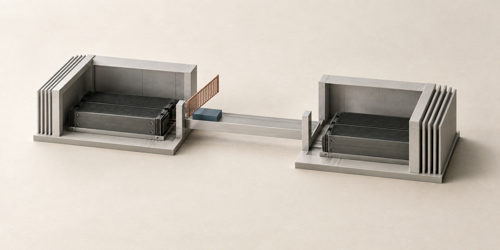

# Cover artwork — span-contract



Unbranded conceptual illustration for this project. These miniature physical models
communicate the subject; they are not engineering diagrams or photographs of deployed hardware.

| File | Use | Dimensions |
| --- | --- | --- |
| [social-preview-v1.jpg](social-preview-v1.jpg) | GitHub social preview | 1280 × 640 |
| [linkedin-v1.jpg](linkedin-v1.jpg) | Website sharing / LinkedIn artwork | 1200 × 627 |
| [cover-v1.png](cover-v1.png) | Full-resolution master | 1774 × 887 |

Both JPEG exports are below 1 MB. The LinkedIn export removes a small amount from
the sides to fit its recommended aspect ratio; the subject is preserved.

## Activate the repository preview

Committing these files does not configure GitHub's social preview.
Open [repository settings](https://github.com/dimaggi-ai/span-contract/settings),
find **Social preview → Edit → Upload an image**, and select `social-preview-v1.jpg`.
See [GitHub's instructions](https://docs.github.com/en/repositories/managing-your-repositorys-settings-and-features/customizing-your-repository/customizing-your-repositorys-social-media-preview).

For a website link, use `linkedin-v1.jpg` as the page's public `og:image`, with
its own title, description and canonical URL. See [LinkedIn's requirements](https://www.linkedin.com/help/linkedin/answer/a521928/making-your-website-shareable-on-linkedin).
Then check a fresh link in [LinkedIn Post Inspector](https://www.linkedin.com/post-inspector/)
and inspect the actual Featured card. Cached or existing cards may need to be re-added.

## Production notes

Created with Codex's built-in image generation tool. Final artwork was visually
reviewed. Exported with macOS `sips` for dimensions and JPEG compression.
No text, logo, author name, date, neon lighting or performance claims appear in the image.

Style reference: [Network cover](https://github.com/dimaggi-ai/network-vs-more-gpus/blob/main/assets/covers/cover-v1.png), used for materials, palette and lighting only.

Alt text: Two miniature data halls connected by a bridge with a raised admission barrier.

### Generation prompt

```text
Use case: stylized-concept. Create one NEW unbranded editorial cover, landscape 2:1, preferably 1280 x 640. Reference image 1 is a reference for palette, material and soft lighting only, NOT an edit target. Change the subject completely. This is a conceptual physical maquette, not a production hardware photograph or an engineering diagram.
Look: restrained architectural-journal still life, matte graphite, pale brushed aluminum, warm chalk tabletop, one small desaturated copper or slate-blue accent where meaningful. Natural diffuse daylight, quiet contact shadows, subtle tactile surface texture, precise clean geometry. High oblique viewpoint, complete subject comfortably inside central 75 percent of canvas, generous empty background, strong silhouette readable at thumbnail scale.
Absolutely no text, numbers, labels, words, logos, DIMAGGI branding, author, date, watermark, charts or metric claims. No glowing lights, neon, bloom, lens flare, particles, purple/cyan gradients, decorative circuitry, brains, robots, futuristic cities, glossy plastic or crowded technology collages. Prioritize one clear idea over detail.
Subject: admission before a training workload crosses a data hall. Two small open-front architectural hall frames stand apart, each containing a single low graphite compute cassette. A narrow pale-metal bridge links the hall thresholds. At the exact bridge entrance is a simple fine copper barrier, shown lifted just enough to allow a single small slate-blue rectangular workload tile through. Few components, no roads or people, no arrows, no text, no glowing network strands. Emphasize the hall boundary and the controlled span.
```
